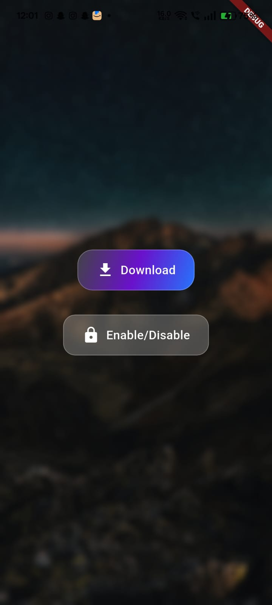

# glass_animated_button

A beautiful animated button with a frosted glass (glassmorphism) effect.  
You can customize text, blur, color, animation, gradients, shadow, and more.

## Features

- Tap animation with customizable duration and curve
- Blur glass effect using BackdropFilter
- Customizable color, gradient, text, borderRadius
- Optional icon
- Optional shadow/glow effect
- Loading and disabled states
- Haptic feedback on tap (optional)
- Accessibility: semantics and keyboard support

## Usage

```dart
GlassAnimatedButton(
  text: "Click Me",
  onPressed: () {
    print("Tapped!");
  },
  blur: 10,
  borderRadius: 20,
  color: Colors.white.withOpacity(0.2),
  animationDuration: Duration(milliseconds: 200),
  animationCurve: Curves.easeInOut,
  icon: Icon(Icons.touch_app, color: Colors.white),
  boxShadow: [
    BoxShadow(
      color: Colors.black.withOpacity(0.2),
      blurRadius: 16,
      offset: Offset(0, 6),
    ),
  ],
  gradient: LinearGradient(
    colors: [Colors.blueAccent.withOpacity(0.3), Colors.purpleAccent.withOpacity(0.3)],
  ),
  enableHapticFeedback: true,
  isLoading: false,
  isDisabled: false,
)
```

## Loading & Disabled Example

```dart
GlassAnimatedButton(
  text: "Download",
  isLoading: true, // shows a spinner
  isDisabled: true, // disables the button
  onPressed: () {},
)
```

## Accessibility
- Fully accessible with screen readers
- Keyboard support (Enter/Space)


# glass_animated_button

A beautiful animated button with a frosted glass (glassmorphism) effect.  
...

---
See the `example/` for a full demo.

