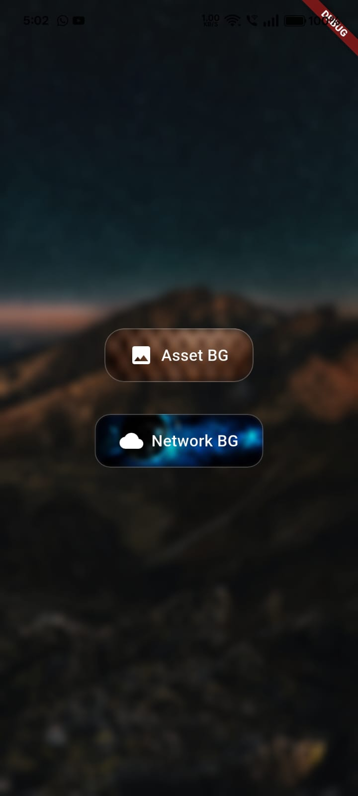

# glass_animated_button



A beautiful animated button with a frosted glass (glassmorphism) effect.  
You can customize text, blur, color, animation, gradients, shadow, and more.

## Features

- Tap animation with customizable duration and curve
- Blur glass effect using BackdropFilter
- Customizable color, gradient, text, borderRadius
- Optional icon
- Optional shadow/glow effect
- Loading and disabled states
- Haptic feedback on tap (optional)
- Accessibility: semantics and keyboard support
- **NEW:** Background image support (asset or network)

## Usage

```dart
// Asset image background
GlassAnimatedButton(
  text: "With Asset BG",
  onPressed: () {},
  backgroundImage: AssetImage('assets/bg.jpg'),
)

// Network image background
GlassAnimatedButton(
  text: "With Network BG",
  onPressed: () {},
  backgroundImage: NetworkImage('https://images.unsplash.com/photo-1506744038136-46273834b3fb?auto=format&fit=crop&w=400&q=80'),
)
```

## Loading & Disabled Example

```dart
GlassAnimatedButton(
  text: "Download",
  isLoading: true, // shows a spinner
  isDisabled: true, // disables the button
  onPressed: () {},
)
```

## Accessibility
- Fully accessible with screen readers
- Keyboard support (Enter/Space)

---
See the `example/` for a full demo.
